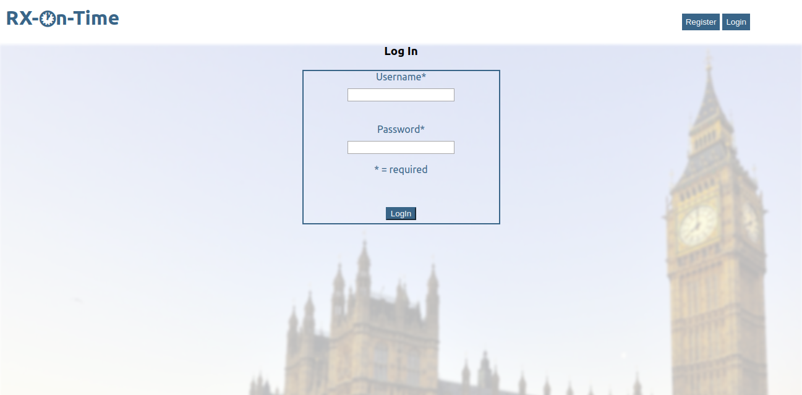

# RX-On-Time -- a full-stack web app for prescription scheduling.

## Live Site

[RXO Live Site](https://rxo-app.rahmor.now.sh/)

[RXO API](https://hidden-lake-74391.herokuapp.com/)

### Core Technologies

- React
- JavaScript
- HTML5/CSS3
- PostgreSQL
- Express
- Node

### How to use RESTful API

Once started, this will run a local API server on `http://localhost:8000`.

POST endpoint:

- api/login

POST endpoint:

- api/register

POST and GET endpoint:

- api/prescriptions

Set your environment variables for the `DATABASE` and `JWT` in an .env file.

Install packages `npm install`

To start the server, run `npm run dev`.

### Author

> Rahim Morgan
